:imagesdir: ./portfolio_posts/gb-emulator
:source-highlighter: pygments
:pygments-style: default
:pygments-css: style
:pygments-linenums-mode: inline
:toc:

https://github.com/chebert/gb-emulator-lisp/blob/master/gb-emulator.lisp[Project Source Code]

.GameBoy Emulator running the BIOS
[.thumb]
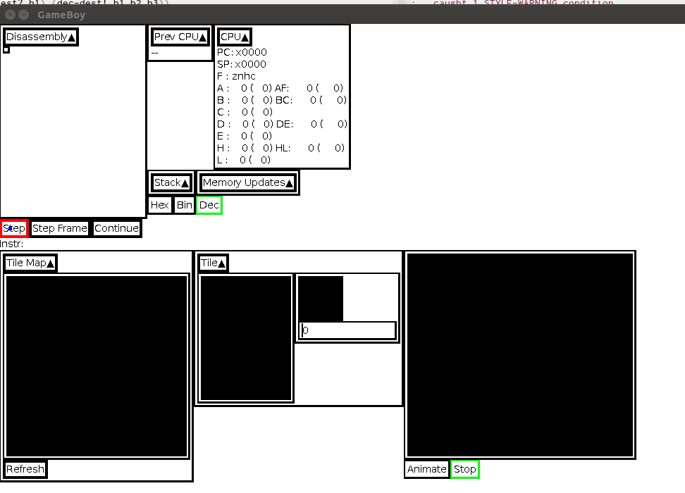

This project demonstrates:

* Understanding and implementation of low-level assembly language
** Understanding of instruction cycles and attention to timings
* Understanding and implementation of hardware based on official documentation
** Understanding of how and when different hardware components interact
* Implementation of a debugger
* Implementation of visualizations of CPU, and graphics data
** Showing state of CPU
* Implementation of a GUI
* "Threading" execution of GameBoy hardware components and execution of real hardware
* Working with a Foreign Function Interface (FFI) to interface with graphics libraries

CAUTION: This project is a work in progress. Currently it only implements enough instructions to run the BIOS, which displays and scrolls the Nintendo Logo. It cannot run any games. It does not emulate sound.

== Project Goals
The goal of this project is to implement Original GameBoy Emulator such that:

* the Emulator can emulate some common titles:
** Tetris
** Dr. Mario
** The Legend of Zelda: Link's Awakening
* it runs at full speed (~60 Frames per Second)
* it has a debugger that:
** supports step, breakpoints, continue, and resuming execution
** displays CPU state and how the CPU state has changed
** displays memory updates for each instruction
** displays regions of memory
** displays relevant memory-based registers
* it has visualizations that:
** display background tiles
** display tile maps
** display memory-based registers in relevant ways
* has full sound support
* has a well-organized and well-documented code-base that is easy to follow for anyone familiar with the domain
* is implemented in Lisp
* uses the SDL library, and as few additional libraries as possible

== Project Demonstration

.The opening screen
[.thumb]
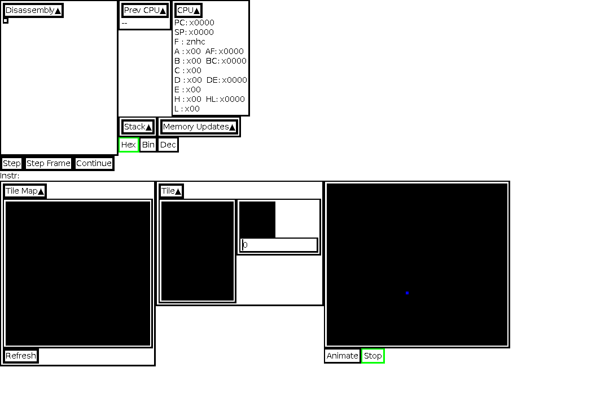

=== Debugger

Pressing step several times results in some history and some some changes to machine.

.Stepping through several instructions
[.thumb]
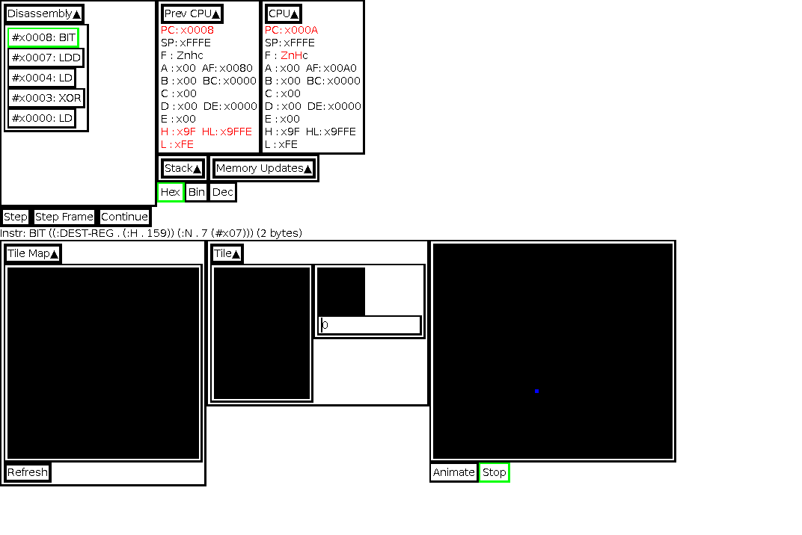

Registers or flags in red highlight what the instruction leading to the CPU state set or changed, even if the value is the same.
"Prev CPU" shows the CPU state immediately prior to "CPU".
Any of the previous history items can be clicked, and the machine state is restored.

.Clicking on a previous machine state
[.thumb]
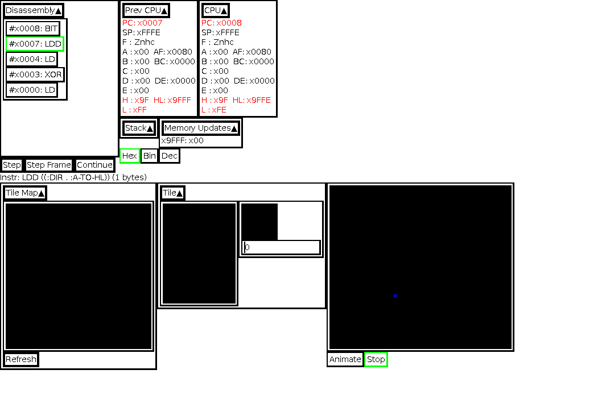

NOTE: This instruction caused an update to memory, view-able in the "Memory Updates" region.

The Hex (hexadecimal), Bin (binary), and Dec (decimal) radio buttons change the display of numeric values.

.Viewing values as binary numbers
[.thumb]
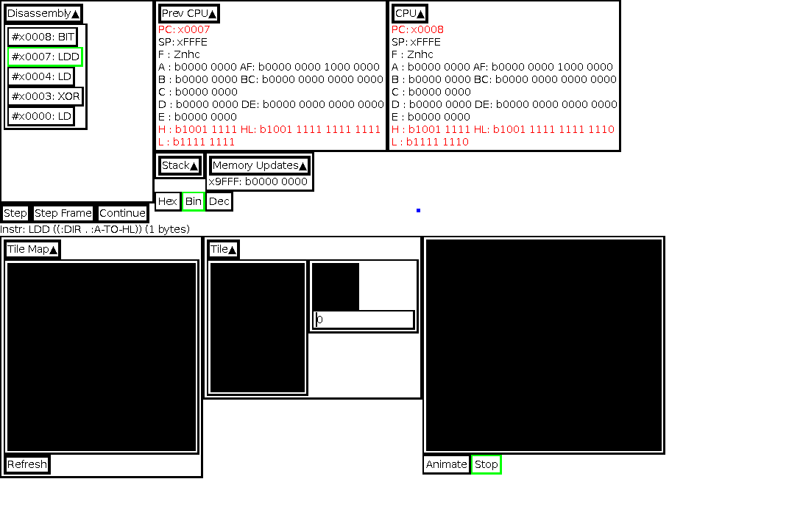

You can click "Dec" to see register values interpreted as signed numbers.

.Viewing values as unsigned and (signed) integers
[.thumb]
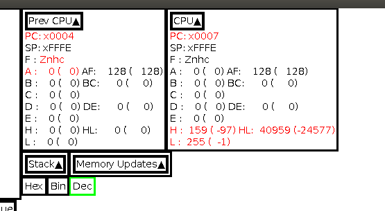

=== Visualizations

The GameBoy has a Sprite tile map, with tiles 8 pixels by 8 pixels.
The Tile window displays all of the tiles laid out in memory.
A specific tile can be zoomed in on using the number entry box.

.Viewing the 26th tile in the tile map: (R).
[.thumb]
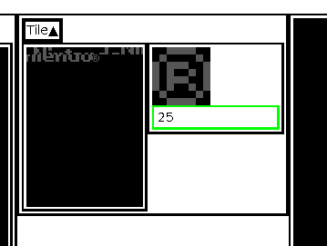

The GameBoy has a background tile map layout, which lays out tiles from the Sprite tile map.
The GameBoy renders a portion of this background tile map to the screen.
The portion and position of the screen is represented as a red rectangle in the Tile Map window.

.Viewing the background tiles laid out on the background tile map.
[.thumb]
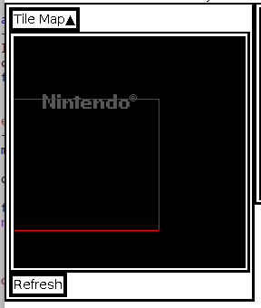

Here it is in motion.

.Watching the output view scroll over the background tile map.
[.thumb]
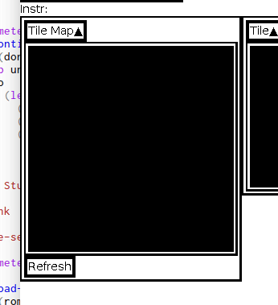

=== GameBoy Screen

The output is displayed in a zoomed-in window.
The Animate/Stop radio button starts or stops the full machine simulation.

.Showing the emulator screen.
[.thumb]
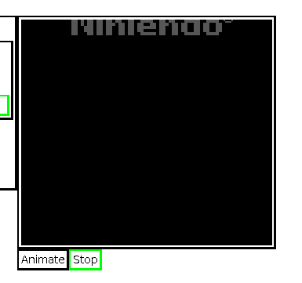

Here it is in motion.

.Showing the emulator screen in action: running the BIOS.
[.thumb]
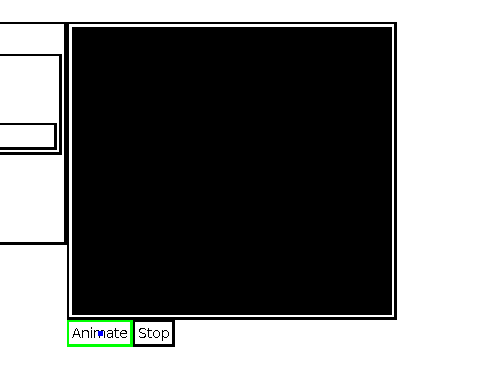

Notice how the output of this screen corresponds to window on the background tile map.

.Showing emulator screen and background tile map simultaneously.
[.thumb]
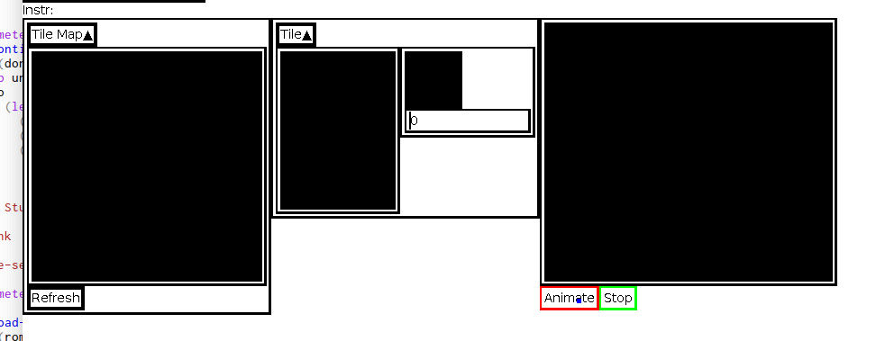

== Code Organization

=== Machine Structures

Each hardware element is modeled as its own structure.
I have my own brand of read-only structure, called `defrecord`, which takes a structure name as its first element, and a list of read-only fields.

.Machine State
[source,lisp,linenums]
----
(defrecord machine-state
  ;; CPU Registers
  pc sp a b c d e f h l
  ;; Memory Regions
  video-ram ext-ram work-ram sprite-ram mmap-i/o z-ram

  ;; Debug Fields
  ;; Lists of what the last instruction changed
  affected-regs affected-flags memory-updates
  ;; The instruction that was just disassembled this step.
  disassembled-instr)
----

Memory are split into regions and stored in global variables, since there are instances of:

* Mirror memory or multiple copies of the same memory
* Multiple regions of memory can occupy the same space at different times

Two functions mapping to and from memory handle this translation: `(mem-byte addr)` and `(mem-byte-set! addr byte)`.

[source,lisp,linenums,highlight='4-9']
----
(defun mem-byte-set! (addr byte)
  (push (cons addr byte) *memory-updates*)
  (cond
    ;; Example of choosing between two memory regions
    ((and (not (bios-run?)) (< addr #x100))
     (setf (aref *bios-rom* addr) byte))
    ((< addr #x4000)
     ;; bank0
     (setf (aref *bank0-rom* addr) byte))
    ((< addr #x8000)
     ;; bank1
     (setf (aref *bank1-rom* (- addr #x4000)) byte))
    ((< addr #xa000)
     ;; vram
     (let ((addr2 (- addr #x8000)))
       (setf (aref *video-ram* addr2) byte)
       (cond
	 ((< addr #x9800)
	  (update-tile-data! addr2))
	 (t
	  ;; update the tile map
	  ))))
    ((< addr #xc000)
     ;; eram
     (setf (aref *ext-ram* (- addr #xa000)) byte))
    ;; Etc., Etc.
     ))
----

NOTE: `mem-byte-set!` updates the list of memory-updates that happened this instruction for the debugger.
It also calls `update-tile-data` when video RAM changes, which updates the pixels displaying the tile data.

=== Flags & Registers

A set of accessors were created for flags and registers, to ensure that `affected-regs` and `affected-flags` were both updated at each instruction for the debugger.

[source,lisp,linenums,highlight='1,5,6,10,11']
----
(defun carry-set! ()
  (push :f *affected-regs*)
  (push :carry *affected-flags*)
  (setq *f* (logior #x10 *f*)))
(defun carry-set? () (not (carry-clear?)))
(defun carry-clear! ()
  (push :f *affected-regs*)
  (push :carry *affected-flags*)
  (setq *f* (logand (lognot #x10) *f*)))
(defun carry-clear? () (zerop (logand #x10 *f*)))
(defun carry-bit () (if (carry-clear?) 0 1))
----

Functions were made to handle endianness and converting between integer types. Examples include:

[source,lisp,linenums,highlight='1-2,6-7']
----
(defun s8 (u8)
  "Returns a signed 8-bit integer given an unsigned 8-bit integer."
  (if (>= u8 #x80)
      (- u8 #x100)
      u8))
(defun u16 (hi lo)
  "Returns an unsigned 16-bit integer given a high byte and a low byte (both unsigned)."
  (+ lo (ash hi 8)))
----

Sub-instructions were created to handle common arithmetic and flag tests. Examples include:

[source,lisp,linenums,highlight='1,5']
----
(defun carry? (byte addend)
  (not (zerop (logand #x100
		      (+ (logand #xff byte)
			 (logand #xff addend))))))
(defun borrow? (byte subtracthend)
  (minusp (- (logand #xff byte) (logand #xff subtracthend))))
----

=== Instructions

I wrote two functions to parse bit-strings to make dis-assembly easier.

[source,lisp,linenums,highlight='1,4']
----
(defun bits-match? (bp1 bp2 either-mask)
  (= (logior bp1 either-mask) (logior bp2 either-mask)))

(defun extract-bits (bits low-idx length)
  "Bits are indexed high to low: e.g. 76543210"
  (logand (ash bits (- low-idx))
          (1- (ash 1 length))))
----

`bits-match?` compares a known instruction op-code, and an instruction byte.
`either-mask` represents parameter bits (e.g. for register names or ALU op-codes).

Instruction implementations use `bits-match?` to determine if the instruction has been called,
`extract-bits` to extract the parameters from the instruction bytes.

[source,lisp,linenums,highlight='1-2,6,8,12']
----
(defun jr-cond-n? (b1)
  (bits-match? b1
               #b00100000
               #b00011000))

(defparameter *conditions* #(:not-zero :zero :not-carry :carry))

(defun jr-cond-n! (b1 b2 b3)
  ;; no flags
  (let ((size 2)
        (n (s8 b2))
        (cnd (aref *conditions* (extract-bits b1 3 2)))
        (cycle-count 8))
    (setq *disassembled-instr*
          (make-disassembled-instr
           :jr
           b1 b2 b3
           size
           cycle-count
           (alist :cond cnd :n n :adr (+ *pc* n size))))
    (cond
      ((test-cond cnd)
       (inc-pc! (+ n size)))
      (t
       (inc-pc! size)))))
----

`jr-cond-n!` implements "jump relative to PC if condition is true".
The condition is extracted from the instruction byte `b1`.

The typical flow of an instruction implementation is:

. Determine if the instruction applies: e.g. `jr-cond-n?`
. Extract the parameters from the instruction bytes
. Set the `\*disassembled-instr*` debug parameter to this instruction
. Perform the instruction operation, setting flags, memory, and registers
. Set the PC (for jumps) or increment the PC by the size of the instruction

A single function sets the debug variables, reads the instruction bytes from memory, and runs through all of the instructions until it finds a match.

[source,lisp,linenums,highlight='2,5,10']
----
(defun exec-instr! ()
  (setq *affected-regs* ()
        *affected-flags* ()
        *memory-updates* ())
  (let ((b1 (mem-pc-byte))
        (b2 (mem-byte (+ *pc* 1)))
        (b3 (mem-byte (+ *pc* 2))))
    (cond
      ;; Loads
      ((ld-reg-imm16? b1) (ld-reg-imm16! b1 b2 b3))
      ((ld-hl-a? b1) (ld-hl-a! b1 b2 b3))
      ;; Etc.

       ;; Stack ops
       ((push/pop-r? b1) (push/pop-r! b1 b2 b3))
      ;; Etc.

      ;; Arithmetic/Bit ops
      ((alu-op-d? b1) (alu-op-d! b1 b2 b3))
      ((alu-op-n? b1) (alu-op-n! b1 b2 b3))
      ;; Etc.
   

      ;; Jumps/Calls
      ((jr-cond-n? b1) (jr-cond-n! b1 b2 b3))
      ((jr-n? b1) (jr-n! b1 b2 b3))
      ;; Etc.
      ))
  :done)
----

=== Main Loop

The Main loop executes at 60 FPS, if the animating toggle is switched, executes 1/60th of a second's worth of code.

[source,lisp,linenums,highlight='1,6,9-10']
----
(defun main-loop! ()
  ;; DEBUG: set the v-blank
  (mem-byte-set! #xff44 #x90)

  (load-rom! *tetris-filename*)
  (gui:main-loop (gui:*input* frames) ; <1>
    (setq *gui* (gui:update-gui! *gui*))

    (when *animating?*
      (step-frame!))

    (modest:draw-color! gui:*color-bg*)
    (ssdl:clear)
    (let ((drawings (modest:drawings-sorted
                     (list (gui:cursor-drawing)
                           (gui:gui-drawing *gui*)))))
      (mapc #'modest:draw-drawing! drawings))
    (ssdl:display)))
----
<1> gui:main-loop runs the code body every 1/60th of a second.
