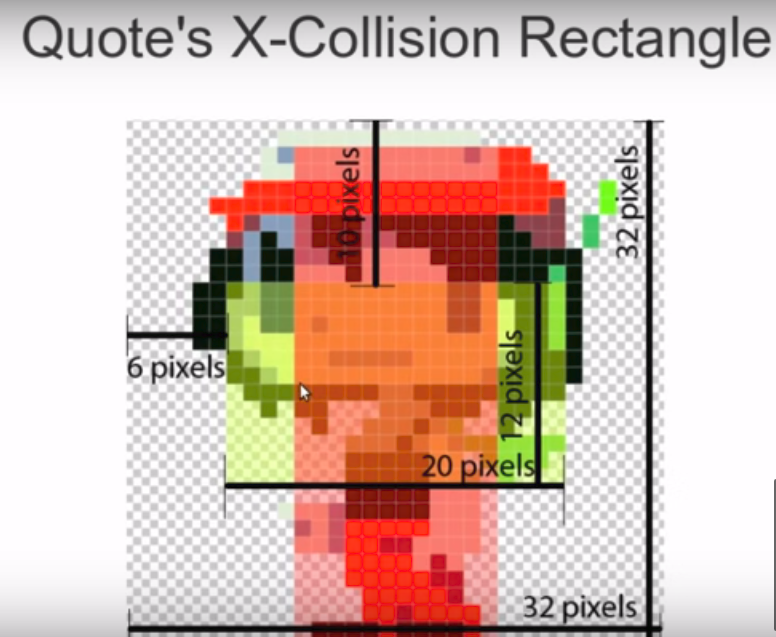

:imagesdir: ./portfolio_posts/cave-story
:source-highlighter: pygments
:pygments-style: default
:pygments-css: style
:pygments-linenums-mode: inline
:toc:

https://www.youtube.com/playlist?list=PL006xsVEsbKjSKBmLu1clo85yLrwjY67X[Video Series]
https://github.com/chebert/cavestory-screencast[Project Source Code]
https://www.reddit.com/r/reconstructcavestory/[Project Forum]

== Project Goals

* Faithfully reconstruct the 2D Platformer: Cave Story
* Explain theory and every line of code on camera
** Do all coding on video, even fixing mistakes
** Don't plan ahead, show complexity of design
* Engage an audience and adjust content to meet audience needs
* Written in C++ & SDL

=== What is Cave Story?

Cave Story is a 2D platformer Indie Game created by a single Japanese man under the pseudonym "Pixel".
It tells the story of a robot who finds himself in the underground caves of a floating island.

.Some of Cave Story's Features
* Explorable environments
* Multiple selectable weapons and upgrades
* Unique level-up system for weapons
* Jump mechanics
* Enemies each with unique behaviors
* Boss fights
* Cutscenes and Dialogue

.Cave Story features dozens of enemy types, each with unique behaviors.

.Cave Story has many unique weapon types.

.Cave Story has many locales and environments

== Project Progress

* 80+ Videos
** 70+ "Episodes"
** 80k+ views
* C++ using SDL1.2 Library and some Boost libraries
* Spawned many re-writes from followers in other languages, demonstrating the clarity of the ideas presented in the videos
** https://github.com/drbawb/rust-story[drbawb's Rust Story]
** https://github.com/JIghtuse/cavestory-sdl2[Cave Story written using modern C++ and SDL2]
** https://github.com/mystal/cavestory-pysdl2[Cave Story in Python]
** Many Others!

=== Summary

.Summary of what was accomplished on video
. Sprite Animations; Episode 4
. Player Movement; Episode 9
. Tile Maps; Episode 11
.. Player/Tile Collisions; Episode 13
. Resolution-independent units; Episode 18
. Enemies; Episode 20
. Damage/Health; Episode 28
. HUD; Episode 28
. Weapons; Episode 34
. Projectiles; Episode 36
.. Projectile Collisions Episode 38
. Particle Effects; Episode 48
. Gun Experience/Leveling Up; Episode 51
. Pickups: Health, Experience; Episode 59
.. Bouncing objects; interact with environment; Episode 57
. Tile Slopes; Episode 66

=== Demonstration

.Episode 4; Demonstration of Animated Sprites

.Episode 9; Problem-solution approach

.Episode 9; Demonstration of Player Movement

.Episode 12; Explaining Tile Collisions

.Episode 22; Taking damage from the bat enemy
image::cave-story-damage.gif[]

.Episode 40.3; Shooting a gun and damage effects

.Episode 70; Pickups and bouncing power crystals

== Code Organization

This project uses an Object-Oriented approach to code organization.
A strong attempt was made to follow the "best practices" laid out in "Effective C++" by Scott Meyers.
Code style used the https://google.github.io/styleguide/cppguide.html[Google C++ Style Guide], with some flexibility.

* Constants prefixed with `k`, using camel case: `kConstantName`
* Member variables suffixed with `\_`, using snake case: `member_variable_name_`
* Classes start with capital letters, using camel case: `ClassName`

When doing the design, I tried to maximize "information hiding" to increase the simplicity.
However, I think that I leaned a bit too hard into this and it resulted in adding complexity.

=== Abstractions

I tried to re-use code whenever possible, but put off creating abstractions until there was code being used in multiple places.
This resulted in some unique abstractions:

* Kinematics. A kinematics object holds the position and velocity of an object at a given time along a single axis; e.g. the x position an x velocity.
* Accelerators. An accelerator object updates a kinematics object according to some pattern.
Example accelerators are FrictionAccelerator, GravityAccelerator, and ConstantAccelerator.
Making these into an object made sense, since friction for example is dependent on the velocity.
A character may have a gravity accelerator applied to the y direction kinematics and friction applied to the x direction kinematics.
* Composite Collision Rectangle.
The main character's collision box is actually made up of 4 collision boxes, one for each of top, left, bottom, and right.
A composite collision rectangle combines these four rectangles to treat them as one collision rectangle.
* Particle. A particle is an entity that is updated and drawn, does not interact with the environment, and has a short lifespan.
Examples include ProjectileStarParticle, ProjectileWallParticle, and DeathCloudParticle.
* Pickup. A pickup is an entity that provides some status-boosting effect when colliding with the player, is updated and drawn, has a short lifespan.

.Kinematics Class
[source,c++,linenums]
----
struct Kinematics {
   Kinematics(
         units::Game position,
         units::Velocity velocity):
      position(position),
      velocity(velocity) {}

   units::Game position;
   units::Velocity velocity;

   units::Game delta(units::MS elapsed_time) { return velocity * elapsed_time; }
};

struct Kinematics2D {
   Position2D position() const { return Position2D(x.position, y.position); }
   Velocity2D velocity() const { return Velocity2D(x.velocity, y.velocity); }
   Kinematics x, y;
};
----

.Accelerators
[source,c++,linenums]
----
struct Accelerator {
   virtual void updateVelocity(Kinematics& kinematics, units::MS elapsed_time) const = 0;
   virtual ~Accelerator() = 0;
};

// Friction Accelerator derives Accelerator

void FrictionAccelerator::updateVelocity(Kinematics& kinematics, units::MS elapsed_time) const {
   kinematics.velocity = kinematics.velocity > 0.0f ?
      std::max(0.0f, kinematics.velocity - friction_ * elapsed_time) :
      std::min(0.0f, kinematics.velocity + friction_ * elapsed_time);
}
----

.Particles
[source,c++,linenums]
----
struct Particle {
   // update returns false when the Particle's lifespan has expired.
   virtual bool update(units::MS elapsed_time) = 0;
   virtual void draw(Graphics& graphics) = 0;
   virtual ~Particle() = 0;
};

// DeathCloudParticle derives Particle
// DeathCloudParticle has sprite_, offset_ and speed_ as member variables.

bool DeathCloudParticle::update(units::MS elapsed_time) {
   sprite_.update();
   offset_.magnitude += speed_ * elapsed_time;
   return sprite_.num_completed_loops() == 0;
}
----

=== Game Units

Cave Story+, a re-release of Cave Story, has two resolutions: the original using 16x16 pixel tiles and an updated resolution using 32x32 pixel tiles.
In order to facilitate both, a Game Unit was used. All positions, velocities, and accelarations, were converted to use the Game Unit before any calculations were done.

.Example Conversion Functions
[source,c++,linenums]
----
typedef float Game; // Float for extra precision. Intrisic units of position.
typedef int Pixel; // Integer for discrete units. Pixel values can be +/-.
typedef unsigned int Tile; // Also discrete, but non-negative.

// HIGH_QUALITY means high resolution, 32x32 pixel tiles.
inline Pixel gameToPixel(Game game) {
   return config::getGraphicsQuality() == config::HIGH_QUALITY ?
      Pixel(round(game)) :
      Pixel(round(game / 2));
}

inline Tile gameToTile(Game game) {
   return Tile(game / kTileSize);
}
----
